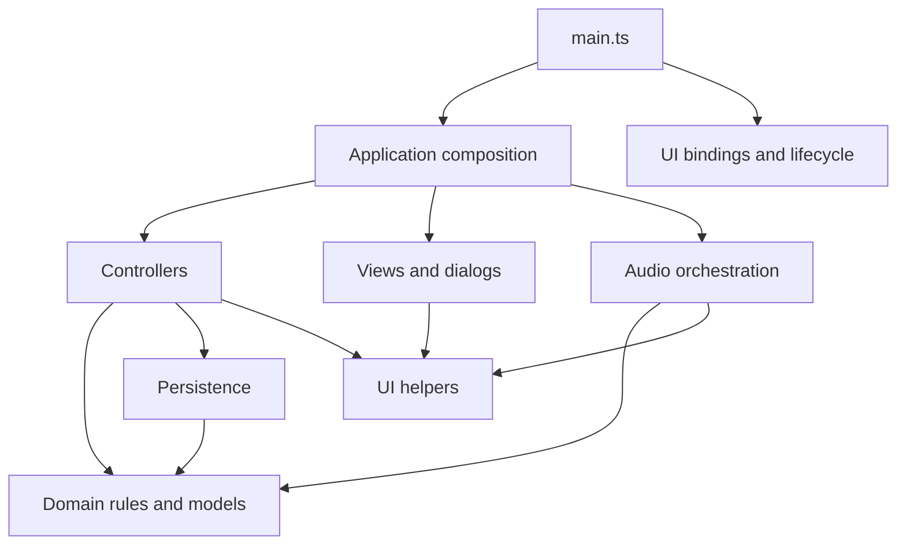

# Architecture and acceptance goals

## Release contract

Users double-click one self-contained `dist/index.html`. Node and npm are development tools only. Vite with vite-plugin-singlefile embeds all JavaScript and CSS; the release has no runtime imports, adjacent assets, CDN, server, service worker, or network requirement. Never edit `dist` manually. `Pitch-Tracker.html` remains the unchanged upstream baseline from `94777d5`.

## Module map

The application uses strict TypeScript without a UI framework. `index.html` contains the static shell and one module entry point. There are no classic application scripts or global bootstrap bridge.

| Location                                              | Responsibility                                                                                                                        |
| ----------------------------------------------------- | ------------------------------------------------------------------------------------------------------------------------------------- |
| `src/main.ts`                                         | Creates the application, loads data, initializes themes, binds events and lifecycle cleanup.                                          |
| `src/app/application.ts`, `state.ts`                  | Explicit `App` contract, method composition, and per-instance mutable state.                                                          |
| `src/domain/session.ts`, `session-changes.ts`         | Session queries, fair next/random selection, roster snapshots, scoring, attendance, finish/resume, class selection, and bounded undo. |
| `src/domain/tracker.ts`, `defaults.ts`, `identity.ts` | v1 data types, initial demo data, IDs, and snapshots.                                                                                 |
| `src/domain/pitch.ts`, `backup.ts`                    | Pure pitch math and validation of portable backups.                                                                                   |
| `src/app/*-controller.ts`, `selectors.ts`             | Coordinate domain transitions, forms, persistence, dialogs, and audio cancellation.                                                   |
| `src/ui/*-view.ts`, `dialogs.ts`, `render.ts`         | Escaped HTML templates, native forms, current-view rendering, and feedback.                                                           |
| `src/ui/events.ts`, `actions.ts`, `lifecycle.ts`      | Delegated named actions, keyboard handling, elapsed timer, visibility and storage events.                                             |
| `src/ui/themes.ts`, `styles.css`                      | Local theme registry and styles bundled into the release.                                                                             |
| `src/audio/microphone.ts`, `detection.ts`             | Device permission, stream and reference-tone lifecycle, pitch analysis, stable holds, and recording.                                  |
| `src/persistence/`                                    | Browser storage adapter and load/save/recovery-backed restore.                                                                        |

Runtime dependency direction:

Modules refer to `App` through **type-only** imports; they do not import the composition root at runtime. Methods explicitly declare `this: App`. Call them on the application object, and wrap calls passed to browser APIs in closures so the receiver is retained. Do not destructure unbound methods.

`SessionState` contains only data and undo snapshots. Domain transitions accept that state explicitly and have no DOM, audio, storage, or rendering dependencies. Optional time, ID, and random inputs support deterministic tests. Controllers own side effects. New rules belong in the domain; new UI behavior belongs in the relevant controller/view pair.

The shared application object stays stable while `app.db` and session objects may be replaced by restore or undo. Delegated callbacks query current state on each invocation. Do not close over old data or session snapshots. Restores clear undo only after successful persistence.

## Data and persistence

The saved format remains schema 1 with storage key `mouthpiece.pitchtracker.v1`. Attempt types now declare the pre-existing optional `originalStatus` field; this is not a migration. Validation preserves extra fields and does not normalize data. Invalid imports do not overwrite valid data. Original measurements and targets remain attached to corrected attempts.

`createTrackerStore` accepts `KeyValueStorage`. Its browser adapter reads localStorage lazily, so denied access is handled inside load/save. Failed saves do not advance the in-memory revision. Controllers surface blocked-save warnings while leaving manual tracking usable.

Restore validates before confirmation, saves a recovery copy, and replaces primary storage before updating UI state. Recovery and primary writes are separate operations, not a transaction: a failed primary restore may update the recovery copy while preserving primary data. Revision checks detect known stale writers but are not an atomic cross-window lock.

Storage belongs to a browser profile/file location, not the HTML file. Moving or renaming the release may expose a different store. JSON export/import is the portable backup path. Theme preference storage remains separate and is not included in backups.

## UI and audio lifecycle

Static and generated controls use `data-ui-click`, `data-ui-change`, `data-ui-input`, and `data-ui-submit` with named actions. IDs and arguments use separate data attributes. The event layer executes only registered actions, handles nested button content, ignores disabled controls, and preserves native form validation and Enter submission. No attribute code is evaluated.

Templates escape user content. Required DOM elements have typed accessors; optional tuner and view elements are checked before access. Theme changes do not rerender forms or interrupt checks.

Microphone requests use a generation counter to stop late streams after cancellation. Checks use a separate generation counter so Escape, view changes, or other cancellations during a pending permission request cannot arm a later check. Silence, frame gaps, instability, reference playback, and session/student changes reset or cancel steady holds. A completed hold records once using the current target and tuning.

Stopping audio cancels animation frames, disconnects the input, stops tracks and active reference tones, and invalidates pending requests. Event binders return cleanup callbacks; development hot replacement removes listeners/timers and closes the old audio context. Page exit stops input and reference playback.

## Verification

`npm run verify` runs strict type checking, linting, formatting, the single-file build, unit tests, and browser tests. Domain tests exercise state transitions, undo limits, roster/target snapshots, selection, and data replacement. Persistence tests exercise malformed records, denied reads, failed writes, revisions, recovery copies, and round trips including corrected attempts.

Playwright runs the built file offline in Chromium and Firefox with ordinary browser security settings. Coverage includes relocation to a path with spaces, manual workflows, forms, keyboard behavior, themes, imports, storage failures, and actions after restore/undo.

Audio browser tests stub only browser device APIs in test code. The production application has no test globals; its actual analysis loop, stable-hold rules, tuning, gate, and recording path run unchanged. Tests also exercise permission denial, delayed permission, cancellation, reference playback, and device disconnection. Synthetic input cannot verify physical microphones, real permission prompts, speakers, or room acoustics.

## Classroom integration

The automatic classroom listener, temporary round queues, and responsive session workspace are integrated into the typed application. The static HTML and main.ts retain the upstream instance bootstrap.

## Automatic classroom listening

The DOM-independent `src/domain/classroom.ts` owns the quiet-gap gate, timed clap grouping, advance policy, and ordered roster navigation. The controller feeds it monotonic frame times, RMS amplitude, detected frequency, and explicit settings. Every completed attempt, navigation, pause, hidden tab, dialog, and reference playback resets the gate. A continuous 500 ms below the configured RMS noise gate is required before another full steady hold can score; pitch-detection failure alone is not quiet. Gaps longer than 250 ms in audio observations cannot satisfy the quiet interval.

Enabling the microphone starts automatic scoring. Auto Advance applies to both manual and microphone results: Until correct retries incorrect results; One and done advances any completed attempt. Navigation follows present roster order, stops at round completion, and never deletes attempts when going back. Random remains a separate fewest-attempts action. Undo covers navigation as well as scores. Round completion is temporary view state; restarting or revisiting a student allows another turn.

Clap navigation is opt-in and off on reopening. Short, loud, unpitched pulses (at most 180 ms, RMS at least 0.08 or four times the noise gate) are grouped with at least 180 ms separation and a 500 ms closing wait. Two navigate forward, three backward; other counts are ignored. Commands are suppressed during a tone hold, pause, reference playback, dialogs, and hidden tabs. They remain available at round completion. This is an acoustic heuristic, not speaker identification: physical classroom and microphone testing is still required to judge false detections.

The advance-mode and clap preferences, pause, and listener state are memory-only controls. The existing v1 Auto Advance boolean and attempt records are unchanged; no saved-data schema or migration is introduced. Unit tests cover the pure timing and navigation rules. Offline file-URL browser tests drive deterministic sine waves, noise bursts, and silence through the actual audio loop, covering retries, one-and-done, continuous-tone rejection, navigation, pause, round completion, and interruption boundaries.

## Responsive session workspace

`src/ui/classroom-view.ts` now owns the active session shell, content views, fullscreen integration, dashboard following, and targeted DOM updates through an explicit `SessionModel`. `src/app/classroom-controller.ts` coordinates the workspace with the current App instance. The initial screen stays in `src/ui/session-view.ts`; other views retain upstream typed controllers.

The session has persistent controls, a current-student display, and an independently scrolling dashboard. Split, Student, and Class are content choices, independent of browser fullscreen. The initial phone view is Student. Short windows, enlarged text, and expanded phone settings allow document scrolling as an accessibility fallback. Expanded settings on shorter displays omit the secondary tuner so feedback and controls remain readable. The microphone continues evaluating in every content view.

Cards retain stable nodes and patch only changed content, including checkbox state. Live audio writes only live indicators; ordinary renders preserve roster scroll and focus. Activation, resizing, and reopening a dashboard reveal the active card by changing only the roster's scroll offset. Manual browsing is left alone until the next activation. Filtered-out active students appear above the results; Show current student explicitly clears the filter/search. Instant scrolling also respects reduced-motion preferences.

Teacher details is a temporary display preference, off on reopening; it hides detailed attempt controls and note access from the student-facing dashboard. It is not access control. All controls continue to use the named delegated-event registry.

`src/domain/round.ts` owns whole-class/retry membership, per-round progress, and summary counts. A round snapshots existing attempt IDs so prior attempts do not count as new work. Retry membership uses the latest saved result and excludes absent or untested students. Skips remain separate from pitch attempts. Undo snapshots the queue, skip markers, completion state, and named result alongside existing session changes. Card, random, button, clap, and automatic navigation preserve historical attempts. Resuming, restoring, or switching sessions resets temporary round state; v1 persistence and backups are unchanged.

The session offers microphone selection after device enumeration becomes available, explicit input-level/signal feedback, and persistent permission/disconnection messages. Changing inputs stops the old stream and resets detection before requesting the selected device. Browser-default input remains available without enumeration. Fullscreen rejection or external exit preserves the selected content view and session data.

Verification includes phone, tablet, half-screen, desktop and projector-size viewports; long names/enlarged text; dashboard scrolling and focus retention; fullscreen success/failure; mocked device permission and switching boundaries; retry and skip/undo behavior; and existing audio, storage, backup, and baseline coverage. Physical room acoustics, clap reliability at distance, and real-device browser support still need classroom acceptance testing.

Retry navigation, including Random, stays within its queue. Nonmembers are labeled Not in this round rather than untested. Deliberately selecting or manually scoring a nonmember adds that student to the temporary round; Undo restores the previous membership.

All classroom callbacks are registered in `createBindings(app)` and resolve the live app on invocation. The workspace is created lazily per application instance and its resize/fullscreen listeners are disposed during hot replacement. Audio code retains generation checks for late permission requests, bound frame callbacks, and reference-tone cleanup. Classroom tests stub browser device APIs and use the Playwright clock; production exposes no app/test globals. Temporary round fields exist only on SessionState/undo snapshots and are never added to TrackerData or v1 backups.
