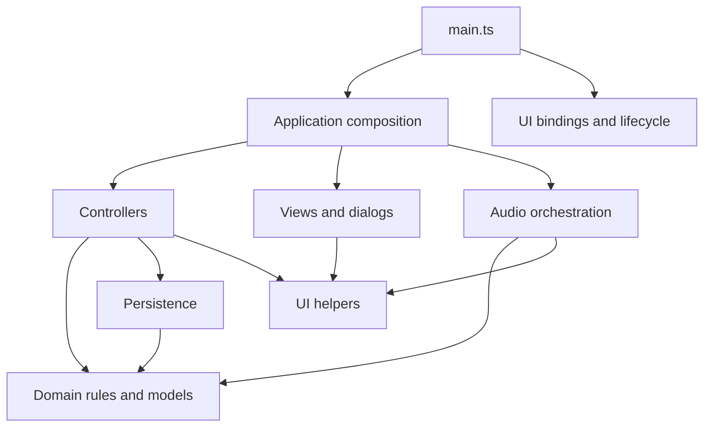

# Architecture and acceptance goals

## Release contract

Users double-click one self-contained `dist/index.html`. Node and npm are development tools only. Vite with vite-plugin-singlefile embeds all JavaScript and CSS; the release has no runtime imports, adjacent assets, CDN, server, service worker, or network requirement. Never edit `dist` manually. `Pitch-Tracker.html` remains the unchanged upstream baseline from `94777d5`.

## Module map

The application uses strict TypeScript without a UI framework. `index.html` contains the static shell and one module entry point. There are no classic application scripts or global bootstrap bridge.

| Location                                              | Responsibility                                                                                                                        |
| ----------------------------------------------------- | ------------------------------------------------------------------------------------------------------------------------------------- |
| `src/main.ts`                                         | Creates the application, loads data, initializes themes, binds events and lifecycle cleanup.                                          |
| `src/app/application.ts`, `state.ts`                  | Explicit `App` contract, method composition, and per-instance mutable state.                                                          |
| `src/domain/session.ts`, `session-changes.ts`         | Session queries, fair next/random selection, roster snapshots, scoring, attendance, finish/resume, class selection, and bounded undo. |
| `src/domain/tracker.ts`, `defaults.ts`, `identity.ts` | v1 data types, initial demo data, IDs, and snapshots.                                                                                 |
| `src/domain/pitch.ts`, `backup.ts`                    | Pure pitch math and validation of portable backups.                                                                                   |
| `src/app/*-controller.ts`, `selectors.ts`             | Coordinate domain transitions, forms, persistence, dialogs, and audio cancellation.                                                   |
| `src/ui/*-view.ts`, `dialogs.ts`, `render.ts`         | Escaped HTML templates, native forms, current-view rendering, and feedback.                                                           |
| `src/ui/events.ts`, `actions.ts`, `lifecycle.ts`      | Delegated named actions, keyboard handling, elapsed timer, visibility and storage events.                                             |
| `src/ui/themes.ts`, `styles.css`                      | Local theme registry and styles bundled into the release.                                                                             |
| `src/audio/microphone.ts`, `detection.ts`             | Device permission, stream and reference-tone lifecycle, pitch analysis, stable holds, and recording.                                  |
| `src/persistence/`                                    | Browser storage adapter and load/save/recovery-backed restore.                                                                        |

Runtime dependency direction:

Modules refer to `App` through **type-only** imports; they do not import the composition root at runtime. Methods explicitly declare `this: App`. Call them on the application object, and wrap calls passed to browser APIs in closures so the receiver is retained. Do not destructure unbound methods.

`SessionState` contains only data and undo snapshots. Domain transitions accept that state explicitly and have no DOM, audio, storage, or rendering dependencies. Optional time, ID, and random inputs support deterministic tests. Controllers own side effects. New rules belong in the domain; new UI behavior belongs in the relevant controller/view pair.

The shared application object stays stable while `app.db` and session objects may be replaced by restore or undo. Delegated callbacks query current state on each invocation. Do not close over old data or session snapshots. Restores clear undo only after successful persistence.

## Data and persistence

The saved format remains schema 1 with storage key `mouthpiece.pitchtracker.v1`. Attempt types now declare the pre-existing optional `originalStatus` field; this is not a migration. Validation preserves extra fields and does not normalize data. Invalid imports do not overwrite valid data. Original measurements and targets remain attached to corrected attempts.

`createTrackerStore` accepts `KeyValueStorage`. Its browser adapter reads localStorage lazily, so denied access is handled inside load/save. Failed saves do not advance the in-memory revision. Controllers surface blocked-save warnings while leaving manual tracking usable.

Restore validates before confirmation, saves a recovery copy, and replaces primary storage before updating UI state. Recovery and primary writes are separate operations, not a transaction: a failed primary restore may update the recovery copy while preserving primary data. Revision checks detect known stale writers but are not an atomic cross-window lock.

Storage belongs to a browser profile/file location, not the HTML file. Moving or renaming the release may expose a different store. JSON export/import is the portable backup path. Theme preference storage remains separate and is not included in backups.

## UI and audio lifecycle

Static and generated controls use `data-ui-click`, `data-ui-change`, `data-ui-input`, and `data-ui-submit` with named actions. IDs and arguments use separate data attributes. The event layer executes only registered actions, handles nested button content, ignores disabled controls, and preserves native form validation and Enter submission. No attribute code is evaluated.

Templates escape user content. Required DOM elements have typed accessors; optional tuner and view elements are checked before access. Theme changes do not rerender forms or interrupt checks.

Microphone requests use a generation counter to stop late streams after cancellation. Checks use a separate generation counter so Escape, view changes, or other cancellations during a pending permission request cannot arm a later check. Silence, frame gaps, instability, reference playback, and session/student changes reset or cancel steady holds. A completed hold records once using the current target and tuning.

Stopping audio cancels animation frames, disconnects the input, stops tracks and active reference tones, and invalidates pending requests. Event binders return cleanup callbacks; development hot replacement removes listeners/timers and closes the old audio context. Page exit stops input and reference playback.

## Verification

`npm run verify` runs strict type checking, linting, formatting, the single-file build, unit tests, and browser tests. Domain tests exercise state transitions, undo limits, roster/target snapshots, selection, and data replacement. Persistence tests exercise malformed records, denied reads, failed writes, revisions, recovery copies, and round trips including corrected attempts.

Playwright runs the built file offline in Chromium and Firefox with ordinary browser security settings. Coverage includes relocation to a path with spaces, manual workflows, forms, keyboard behavior, themes, imports, storage failures, and actions after restore/undo.

Audio browser tests stub only browser device APIs in test code. The production application has no test globals; its actual analysis loop, stable-hold rules, tuning, gate, and recording path run unchanged. Tests also exercise permission denial, delayed permission, cancellation, reference playback, and device disconnection. Synthetic input cannot verify physical microphones, real permission prompts, speakers, or room acoustics.
