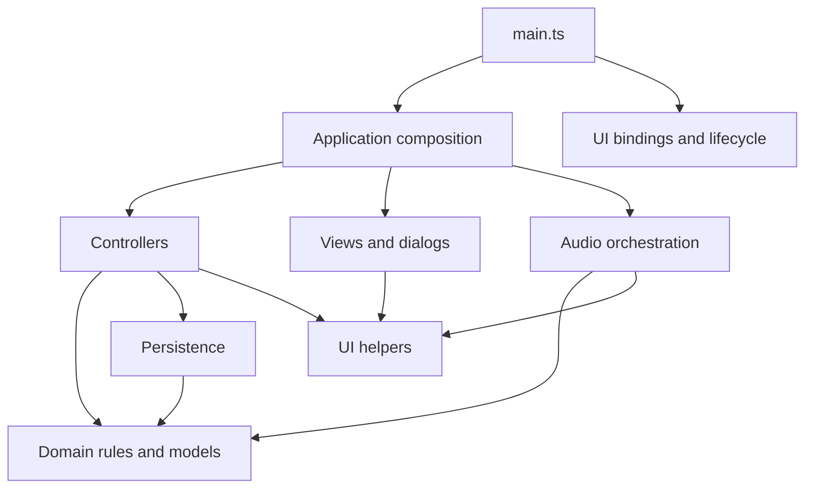

# Architecture and acceptance goals

## Recorded-attempt feedback popups

Successful manual and microphone recordings both call the application's `PitchFeedback` presenter after recording and auto-advance. The popup uses the recorded student's name, a factual rating, a directional arrow/checkmark and a shuffled phrase. It is a native modal dialog in the static shell, so it works in fullscreen without changing split-view geometry. Continue, Escape or the configured timeout close it and restore native focus. The audio loop and session keyboard shortcuts pause while it is open; recording resumes through the existing fresh-quiet arming rules after dismissal. Live pitch changes do not trigger popups.

`src/themes/feedback.json` supplies complete generic defaults and optional theme overrides. Each rating falls back independently; a nonempty custom pool replaces the default pool. `defaults.durationMs` provides one shared 1000 ms default (integer range 500–30000); themes cannot override timing. A saved user duration overrides this shared default. The control is available in session Settings and Classes & settings, accepts 0.5–30 seconds, saves automatically, and uses the shared default when left blank. Catalog validation rejects unknown theme IDs, unknown keys, invalid timing, blank/duplicate phrases and phrases over 100 characters. `src/themes/feedback.ts` handles validation, resolution and per-instance shuffle bags without browser APIs. Every phrase is used before reshuffling, with no immediate repeat across bag boundaries when alternatives exist.

`src/ui/pitch-feedback.ts` owns the modal's DOM, timer and event cleanup. New results replace the current popup and cancel its timer. Theme changes, undo, round resets, leaving the session, pagehide and application disposal clear it. Text is inserted with DOM text APIs. The dialog's accessible name/description announce the phrase and factual result; the persistent last-result area no longer independently announces the same recording. Operational messages retain the existing `toast()` path. Messages and timers are transient. Saving a user duration explicitly upgrades data to schema 3, adding `settings.feedbackDurationMs` (null means the shared default). Versions 1 and 2 remain readable and unchanged until the user edits timing; the upgrade preserves existing targets and measurements. Subsequent pitch-setting saves preserve schema 3. Backup validation checks timing before any restore writes. Migration and export/import/reload tests cover the preference. No dependency or runtime fetch is added.

`src/feedback.css` provides shared modal sizing and token-driven appearance. Generic feedback follows each theme's semantic colors. Boom Pow adds comic lettering, an ink outline/shadow, a yellow burst and a brief entrance animation; reduced motion disables animation. Unit coverage checks catalog failures, partial fallback, timing and shuffle behavior. Offline file-URL Chromium/Firefox coverage exercises all ratings, automatic/manual recording, modal input isolation, timing replacement, focus/dismissal, theme reset and fullscreen laptop/desktop plus phone geometry.

## Application header

`src/header-layout.css` owns the shared app bar geometry after theme paint. The compact title, main navigation, theme selector and backup utilities share one desktop row; navigation wraps to a separate row below 1200px, with utilities also stacking on phones. Save status remains visible next to its backup action, including on phones. The eyebrow and decorative tagline are removed. Themes retain their colors, fonts and control treatments without changing header dimensions. Navigation is inside the header so native fullscreen hides all app chrome together. No controller or saved-data format changes are involved. Offline file-URL browser coverage checks all themes at phone, intermediate, laptop and desktop widths, control overlap, navigation and fullscreen visibility.

## Release contract

Users double-click one self-contained `dist/index.html`. Node and npm are development tools only. Vite with vite-plugin-singlefile embeds all JavaScript and CSS; the release has no runtime imports, adjacent assets, CDN, server, service worker, or network requirement. Never edit `dist` manually. `Pitch-Tracker.html` remains the unchanged upstream baseline from `94777d5`.

GitHub Pages serves the same self-contained build as the downloadable release. The verification workflow uploads `dist` as a Pages artifact after all checks pass and deploys it only for `main` pushes or manual runs on `main`. Repository Pages settings must use GitHub Actions as the publishing source. Generated `dist` remains gitignored; the source-root `index.html` is a development entry point and must not be published directly.

## Module map

The application uses strict TypeScript without a UI framework. `index.html` contains the static shell and one module entry point. There are no classic application scripts or global bootstrap bridge.

| Location                                              | Responsibility                                                                                                                        |
| ----------------------------------------------------- | ------------------------------------------------------------------------------------------------------------------------------------- |
| `src/main.ts`                                         | Creates the application, loads data, initializes themes, binds events and lifecycle cleanup.                                          |
| `src/app/application.ts`, `state.ts`                  | Explicit `App` contract, method composition, and per-instance mutable state.                                                          |
| `src/domain/session.ts`, `session-changes.ts`         | Session queries, fair next/random selection, roster snapshots, scoring, attendance, finish/resume, class selection, and bounded undo. |
| `src/domain/tracker.ts`, `defaults.ts`, `identity.ts` | v1 data types, initial demo data, IDs, and snapshots.                                                                                 |
| `src/domain/pitch.ts`, `pitch-hold.ts`, `backup.ts`   | Pitch detection, timed pitch evidence, display smoothing, and portable backup validation.                                             |
| `src/app/*-controller.ts`, `selectors.ts`             | Coordinate domain transitions, forms, persistence, dialogs, and audio cancellation.                                                   |
| `src/ui/*-view.ts`, `dialogs.ts`, `render.ts`         | Escaped HTML templates, native forms, current-view rendering, and feedback.                                                           |
| `src/ui/events.ts`, `actions.ts`, `lifecycle.ts`      | Delegated named actions, keyboard handling, elapsed timer, visibility and storage events.                                             |
| `src/themes/`, `src/ui/themes.ts`, `styles.css`       | Local theme registry and styles bundled into the release.                                                                             |
| `src/audio/microphone.ts`, `detection.ts`             | Device permission, stream and reference-tone lifecycle, pitch analysis, stable holds, and recording.                                  |
| `src/persistence/`                                    | Browser storage adapter and load/save/recovery-backed restore.                                                                        |

Runtime dependency direction:

Modules refer to `App` through **type-only** imports; they do not import the composition root at runtime. Methods explicitly declare `this: App`. Call them on the application object, and wrap calls passed to browser APIs in closures so the receiver is retained. Do not destructure unbound methods.

`SessionState` contains only data and undo snapshots. Domain transitions accept that state explicitly and have no DOM, audio, storage, or rendering dependencies. Optional time, ID, and random inputs support deterministic tests. Controllers own side effects. New rules belong in the domain; new UI behavior belongs in the relevant controller/view pair.

The shared application object stays stable while `app.db` and session objects may be replaced by restore or undo. Delegated callbacks query current state on each invocation. Do not close over old data or session snapshots. Restores clear undo only after successful persistence.

## Data and persistence

The loader and validator accept schemas 1, 2, and 3. Schema 3 adds both the nullable user feedback duration and saved session defaults described below. Saving graphical pitch settings explicitly calls `migrateToV2`: clone validated data, promote schema 1 to 2 without downgrading schema 3, and add zero-cent offsets to existing configurations and historical attempt targets. Schema 2 adds an optional `PitchTarget.offset` in cents (−600 to +600); omission means zero. Scoring and reference playback share this tuning convention. Schema 1 remains unchanged until pitch settings, feedback timing, or session defaults are saved, and all supported backup versions round-trip through validation. Original measurements and targets remain attached to corrected attempts. Invalid imports and unsupported versions do not overwrite valid data.

The storage key remains `mouthpiece.pitchtracker.v1` to discover existing file-URL data and retain the existing revision/recovery mechanism; the payload's schema is the format version. Backups with schema 3 require a release that supports user feedback timing and session defaults. Validation preserves extra fields without normalizing input. Migration tests cover unchanged historical measurements, zero-offset defaults, round trips, and invalid imports before writes.

`createTrackerStore` accepts `KeyValueStorage`. Its browser adapter reads localStorage lazily, so denied access is handled inside load/save. Failed saves do not advance the in-memory revision. Controllers surface blocked-save warnings while leaving manual tracking usable.

Restore validates before confirmation, saves a recovery copy, and replaces primary storage before updating UI state. Recovery and primary writes are separate operations, not a transaction: a failed primary restore may update the recovery copy while preserving primary data. Revision checks detect known stale writers but are not an atomic cross-window lock.

Storage belongs to a browser profile/file location, not the HTML file. Moving or renaming the release may expose a different store. JSON export/import is the portable backup path. Theme preference storage remains separate and is not included in backups.

## UI and audio lifecycle

`Alt+Enter` toggles session fullscreen through the existing view action, including when a session control has focus. The lifecycle binding ignores key repeats, composition, extra modifiers, and open dialogs; fullscreen failures use the existing view feedback.

Static and generated controls use `data-ui-click`, `data-ui-change`, `data-ui-input`, and `data-ui-submit` with named actions. IDs and arguments use separate data attributes. The event layer executes only registered actions, handles nested button content, ignores disabled controls, and preserves native form validation and Enter submission. No attribute code is evaluated.

Templates escape user content. Required DOM elements have typed accessors; optional tuner and view elements are checked before access. Theme changes do not rerender forms or interrupt checks.

Microphone requests use a generation counter to stop late streams after cancellation. Checks use a separate generation counter so Escape, view changes, or other cancellations during a pending permission request cannot arm a later check. Frame gaps, long interruptions, reference playback, and session/student changes reset or cancel pitch evidence. Brief missing or outlying observations can be tolerated for correct results. A completed hold records once using the current target and tuning.

Stopping audio cancels animation frames, disconnects the input, stops tracks and active reference tones, and invalidates pending requests. Event binders return cleanup callbacks; development hot replacement removes listeners/timers and closes the old audio context. Page exit stops input and reference playback.

## Verification

`npm run verify` runs strict type checking, linting, formatting, the single-file build, unit tests, and browser tests. Domain tests exercise state transitions, undo limits, roster/target snapshots, selection, and data replacement. Persistence tests exercise malformed records, denied reads, failed writes, revisions, recovery copies, and round trips including corrected attempts.

Playwright runs the built file offline in Chromium and Firefox with ordinary browser security settings. Coverage includes relocation to a path with spaces, manual workflows, forms, keyboard behavior, themes, imports, storage failures, and actions after restore/undo.

Audio browser tests stub only browser device APIs in test code. The production application has no test globals; its actual analysis loop, stable-hold rules, tuning, gate, and recording path run unchanged. Tests also exercise permission denial, delayed permission, cancellation, reference playback, and device disconnection. Synthetic input cannot verify physical microphones, real permission prompts, speakers, or room acoustics.

## Classroom integration

The automatic classroom listener, temporary round queues, and responsive session workspace are integrated into the typed application. The static HTML and main.ts retain the upstream instance bootstrap.

## Automatic classroom listening

The DOM-independent `src/domain/classroom.ts` owns the quiet-gap gate, timed clap grouping, advance policy, and ordered roster navigation. The controller feeds it monotonic frame times, RMS amplitude, detected frequency, and explicit settings. Every completed attempt, navigation, pause, hidden tab, dialog, and reference playback resets the gate. A new turn requires 500 ms below the configured RMS noise gate, or 800 ms of settled unpitched background (the maximum RMS is at most 1.5 times the minimum). A detected sustained note is never learned as background; a short loss of pitch or an isolated impact cannot arm a turn. Gaps longer than 250 ms restart settling. This handles steady broadband room noise without raising the pitch gate or assuming that every undetected pitch is silence. Tonal machinery and severely masked instruments remain ambiguous.

Enabling the microphone starts automatic scoring. Auto Advance applies to both manual and microphone results: Until correct retries incorrect results; One and done advances any completed attempt. Navigation follows present roster order, stops at round completion, and never deletes attempts when going back. Random remains a separate fewest-attempts action. Undo covers navigation as well as scores. Round completion is temporary view state; restarting or revisiting a student allows another turn.

Clap navigation is opt-in and initially off; explicit Session defaults can enable it on reopening. Short, loud, unpitched pulses (at most 180 ms, RMS at least 0.08 or four times the noise gate) are grouped with at least 180 ms separation and a 500 ms closing wait. Two navigate forward, three backward; other counts are ignored. Commands are suppressed during a tone hold, pause, reference playback, dialogs, and hidden tabs. They remain available at round completion. This is an acoustic heuristic, not speaker identification: physical classroom and microphone testing is still required to judge false detections.

The advance-mode and clap session overrides, pause, and listener state are memory-only controls. Version 3 Session defaults can supply the initial advance mode and clap preference. The existing v1 Auto Advance boolean and attempt records are unchanged; no saved-data schema or migration is introduced. Unit tests cover the pure timing and navigation rules. Offline file-URL browser tests drive deterministic sine waves, noise bursts, and silence through the actual audio loop, covering retries, one-and-done, continuous-tone rejection, navigation, pause, round completion, and interruption boundaries.

## Responsive session workspace

`src/ui/classroom-view.ts` now owns the active session shell, content views, fullscreen integration, dashboard following, and targeted DOM updates through an explicit `SessionModel`. `src/app/classroom-controller.ts` coordinates the workspace with the current App instance. The initial screen stays in `src/ui/session-view.ts`; other views retain upstream typed controllers.

The session has persistent controls, a current-student display, and an independently scrolling dashboard. Split, Student, and Class are content choices, independent of browser fullscreen. The initial phone view is Student. Short windows, enlarged text, and expanded phone settings allow document scrolling as an accessibility fallback. Expanded settings on shorter displays omit the secondary tuner so feedback and controls remain readable. The microphone continues evaluating in every content view.

Cards retain stable nodes and patch only changed content, including checkbox state. Live audio writes only live indicators; ordinary renders preserve roster scroll and focus. Activation, resizing, and reopening a dashboard reveal the active card by changing only the roster's scroll offset. Manual browsing is left alone until the next activation. Filtered-out active students appear above the results; Show current student explicitly clears the filter/search. Instant scrolling also respects reduced-motion preferences.

Teacher details is a temporary display preference, initially off unless enabled in Session defaults; it hides detailed attempt controls and note access from the student-facing dashboard. It is not access control. All controls continue to use the named delegated-event registry.

`src/domain/round.ts` owns whole-class/retry membership, per-round progress, and summary counts. A round snapshots existing attempt IDs so prior attempts do not count as new work. Retry membership uses the latest saved result and excludes absent or untested students. Skips remain separate from pitch attempts. Undo snapshots the queue, skip markers, completion state, and named result alongside existing session changes. Card, random, button, clap, and automatic navigation preserve historical attempts. Resuming, restoring, or switching sessions resets temporary round state; v1 persistence and backups are unchanged.

The session offers microphone selection after device enumeration becomes available, explicit input-level/signal feedback, and persistent permission/disconnection messages. Changing inputs stops the old stream and resets detection before requesting the selected device. Browser-default input remains available without enumeration. Fullscreen rejection or external exit preserves the selected content view and session data.

Verification includes phone, tablet, half-screen, desktop and projector-size viewports; long names/enlarged text; dashboard scrolling and focus retention; fullscreen success/failure; mocked device permission and switching boundaries; retry and skip/undo behavior; and existing audio, storage, backup, and baseline coverage. Physical room acoustics, clap reliability at distance, and real-device browser support still need classroom acceptance testing.

Retry navigation, including Random, stays within its queue. Nonmembers are labeled Not in this round rather than untested. Deliberately selecting or manually scoring a nonmember adds that student to the temporary round; Undo restores the previous membership.

All classroom callbacks are registered in `createBindings(app)` and resolve the live app on invocation. The workspace is created lazily per application instance and its resize/fullscreen listeners are disposed during hot replacement. Audio code retains generation checks for late permission requests, bound frame callbacks, and reference-tone cleanup. Classroom tests stub browser device APIs and use the Playwright clock; production exposes no app/test globals. Temporary round fields exist only on SessionState/undo snapshots and are never added to TrackerData or v1 backups.

## Noise-tolerant pitch scoring

The previous detector rejected synthetic A4 plus moderate broadband noise, and the old hold discarded all progress after any unreliable sample or pitch-spread outlier. Regression fixtures capture clean tones and those failing mixtures before the change; they are generated signals, not recordings of the reported vacuum.

`detectPitch` retains the target-independent [YIN approach](https://pubmed.ncbi.nlm.nih.gov/12002874/) and 55 to 1600 Hz search range. A two-pole Butterworth low-pass at 2 kHz reduces broadband energy; the first 3 ms of filter startup are discarded. The normalized-difference acceptance threshold changes from 0.12 to 0.18. This is a periodicity criterion, not a calibrated probability. The original input RMS gate still applies. No closest-target search or octave correction is used. Browser speech processing remains requested off; the application performs its own deterministic filtering. No new dependencies or runtime fetches are needed.

`PitchHold` integrates elapsed milliseconds, not frame counts, over the most recent configured hold duration. It requires a full observation window before saving, and credits only intervals bracketed by reliable observations of the same status within the configured pitch spread. Within each status, it finds the most-supported frequency band no wider than that spread. Correct results require 85% of the window in that band (1,700 ms in a 2,000 ms window). Low/high results retain the stricter requirement of a full window of stable evidence. The saved frequency is the time-weighted median of supporting measurements, evaluated against the current target and A4. It cannot average low and high into correct or combine different octaves for an exact-octave target. The current observation must agree with the winning band; a result is never completed during silence.

A missing-pitch interruption longer than 350 ms, a callback gap over 250 ms, or explicit cancellation clears evidence. Old evidence also ages out of the rolling window, so isolated short successes cannot accumulate indefinitely. Because credit needs two reliable endpoints, the practical tolerated dropout is slightly shorter than 15% of the window. Short hold settings necessarily have less interruption tolerance at the approximately 80 ms analysis cadence. The 85% rule is an internal policy; the existing hold and stability settings and v1 saved-data format are preserved. A settings change cancels evidence before applying the new target/tuning.

`PitchDisplay` uses a three-observation median for live feedback only, with a maximum 250 ms history and immediate clearing on unreliable input. Raw reliable frequencies feed scoring; display smoothing never supplies substitute evidence. Both objects belong to the current App instance and reset on cancellation.

### Regression from actual room recordings

The user's follow-up recordings exposed a separate harmonic-selection error that the initial sine/noise tests did not cover. A dominant fifth harmonic could meet YIN's absolute threshold before the fundamental was considered; the file labeled C produced approximately 1556 Hz instead of its approximately 311 Hz fundamental. The file labeled F Sharp also switched among harmonic-related candidates. The user confirmed a tuner transposition setting caused the mismatch between intended note names and the recorded sounding pitches. The detector must measure concert pitch, not compensate silently for that setting.

The detector now computes the complete difference curve. It chooses the shortest local-minimum period below both the absolute 0.18 threshold and the best normalized difference plus 0.02. Comparing candidate quality rejects a loud overtone whose period fails to explain the quieter components, while the 0.02 allowance avoids selecting unnecessarily long subharmonic periods because of small noise/interpolation differences. This remains a monophonic heuristic and is not a guarantee for arbitrary mixtures or absent fundamentals.

`tests/fixtures/recordings/README.md` documents independent spectral analysis and preparation of the three supplied recordings as compressed mono PCM, including original attachment hashes. Unit tests scan their full waveforms and add synthetic dominant third/fifth/seventh harmonics at several sample rates. Offline browser tests play all three through the real detection/scoring path with a 2-second hold. They verify correct saved results for measured sounding targets and incorrect results for the mismatched filename targets. Test audio is not part of the standalone release. Saved-data format and pitch-target math remain unchanged.

Unit coverage includes clean 55 to 1568 Hz signals at 44.1/48/96 kHz, harmonic-rich tones, noisy A at 44.1/48 kHz with several phases, noise alone, a transient, buried tones, bounded accumulation, persistent wrong notes, octave errors, alternating flat/sharp, varying frame rates, and callback stalls. Offline Chromium/Firefox tests drive the built release through mixed noise plus A, a noise burst mid-note, saved correct/low results, no duplicate results, background-only handoffs, and interruption/cancellation paths. Synthetic fixtures are repeatable acceptance cases, not a guarantee across room acoustics. Strong tonal machinery, competing players, microphone clipping, and a note drowned out by noise can still produce ambiguous or wrong pitches. A real-room follow-up should inspect the saved measured Hz/cents and verify the intended target and A4 before further threshold tuning.

## Graphical pitch and detection settings

`src/ui/pitch-settings.ts` renders and updates unsaved form drafts through delegated actions. Each instrument has note and octave selectors (including the existing any-octave behavior), a local SVG staff, and three native range inputs on a shared pitch axis. The three handles overlap one shared track; native keyboard focus keeps coincident handles individually adjustable. Min/max are stored relative to the tuned target; moving Target preserves both tolerances. Fine scale spans ±50 cents, Normal ±100, and Wide ±200. Existing larger configurations receive a Saved range option to preserve their bounds; target tuning is limited to ±600 and each tolerance to the existing ±600. A narrower scale cannot hide existing bounds. Editing boundaries prevents crossing Target; untouched older configurations keep their original ranges.

The staff automatically chooses treble at C4 or above and bass below. A clef click overrides this for the current draft; Auto restores automatic selection. Clef and scale choices are presentation-only. Any-octave previews use octave 4, matching playback. Custom pitches show an explicit text indicator and cents offset; semitone-aligned offsets show On pitch. All staff geometry is inline SVG with no music font or asset fetch.

A4 tuning, hold duration, allowed spread, and noise gate use native sliders with visible values, units, endpoint explanations, and keyboard support. Settings are applied only on Save, which cancels active pitch evidence. Session/history labels and CSV exports include custom offsets. Offline Chromium and Firefox tests exercise the built HTML, note/clef changes, dragging and keyboard input, reload persistence, and actual custom-tone playback and measurement through the test audio-device boundary.

The treble and bass clefs use the Bravura U+E050 and U+E062 outlines (SIL Open Font License; see `docs/licenses/Bravura.txt`), converted to inline filled SVG paths with origins on the G4 and F3 staff lines respectively. Their engraved stroke contrast is preserved without shipping a font or adding runtime dependencies.

## Appearance-only theme contract

Theme definitions are data-only `src/themes/*.theme.ts` modules, automatically bundled by an eager Vite glob. `contract.ts` owns typed keys, complete Classic defaults, resolution and registry validation. `src/ui/themes.ts` only applies resolved tokens and coordinates selection/storage/listeners. Each switch writes the complete token set to prevent previous-theme leakage. Existing theme IDs, default selection and theme storage key are preserved; tracker v1 data is unchanged.

Themes control surface/typographic decoration; shared CSS retains layout, responsive sizing and interaction geometry, and existing inline music SVG remains untouched. The original mech treatment remains an explicitly typed legacy option. No runtime theme fetch or remote assets are introduced. See [themes.md](themes.md) for the copy-file/build workflow, token reference and limits. Unit tests validate discovery, defaults and malformed definitions; offline file-URL browser tests cover appearance, selection persistence, fallback, clean switching, draft retention and unchanged staff geometry at phone and desktop widths.

### Reference-theme contract preparation

`contract.ts` now exports a fixed `ThemeTreatment` vocabulary and adds independent surface/display foregrounds, reading/label typography, heading/label weights, and display/pressed-button shadows. Palette-relative defaults preserve inheritance for existing dark themes. The shared stylesheet now consumes all 12 appearance extensions; the eight non-mech treatments still need decorative CSS implementation. No new theme files, fonts, meter renderers, DOM changes, domain logic, or saved-data fields are included. Cel-Shaded Mech explicitly carries its existing tuner background/shadow in tokens. Label styling is isolated from nested form values, and semantic control colors retain priority. Tuner hints use the display foreground, which makes the default hint brighter and keeps contrasting inset displays readable. Validation checks untyped treatment/scheme values and malformed definitions as well as existing asset restrictions. See the handoff section of `docs/themes.md` before authoring or wiring reference-inspired themes.

Consumer verification captures the existing three themes at phone/desktop widths before wiring, compares typography and geometry afterward, and exercises all new tokens in offline Chromium/Firefox. Coverage includes independent display/card/control colors, numerical and label fonts, font weights, label tracking/transforms, enabled/disabled pressed states, keyboard focus, semantic feedback colors, unchanged clef markup/size, theme reset and unsaved draft retention.

### Pitch Press print treatment

Pitch Press now has a dedicated build-owned stylesheet (`src/themes/pitch-press.css`), imported by the application entry. The theme module remains palette/typography data. The print treatment adds the two-color masthead, paper grain, heavy rules, hard button shadows, a graduated meter and a yellow result panel. Anton and Alfa Slab One are bundled locally under the SIL Open Font License (licenses in `docs/licenses/`); small deterministic paper/ink PNG textures and both fonts are inlined by the single-file build. No runtime requests or dependencies are added.

The existing classroom view supplies a shared concert-target panel and playback/navigation controls through the existing delegated actions. Target frequency uses the same pure `targetFrequency` function as reference playback, including A4 tuning and custom offsets. Octave remains visible as a subordinate numeral. Live microphone readings remain separately labeled in the tuner; the poster never substitutes the target for a measurement. The result color reflects the latest saved attempt for the current student in this round, clears on navigation to an untested student, and is never driven by decorative timers. Tracker v1 data and scoring/audio logic are unchanged.

All themes use the same viewport-bound session workspace; Split retains the dashboard and Class suppresses the poster. Theme styles must not change workspace height, scrolling, or panel topology. Print decoration disappears when switching themes; the shared target, tuner, feedback, and controls remain mounted. Offline file-URL coverage at phone and desktop widths exercises target playback, actual audio scoring, result styling, next-student navigation, theme reset, and Class view. The mockup governs the print palette and display styling; real student identity, teacher controls and live signal feedback remain available around the poster.

### Viewport session workspace

`src/session-layout.css` owns session geometry and is loaded after theme paint. Session controls, content-view selection, fullscreen, and behavior settings live in a collapsible left sidebar. Expanded settings and the sidebar scroll internally when space is limited. The toggle remains visible and exposes its state through `aria-expanded` and `aria-controls`; collapsing removes controls from keyboard navigation. Sidebar state belongs to the current `SessionView`, survives renders, and adds no saved-data fields. The existing site header and navigation remain above the session; native fullscreen hides them until exit.

The document does not scroll during an active session. Flex/grid minimum sizes constrain the workspace, student panel, and roster to the remaining viewport. The roster scrolls internally and retains current-student following; student overflow remains reachable internally on small screens and with enlarged text. Shared target sizing bounds decorative typography so theme artwork cannot expand the workspace. Offline file-URL tests cover collapse/reopen, all themes and content views, short landscape/phone/desktop viewports, roster overflow, and fullscreen exit.

### Two canonical themes

Cel-Shaded Mech and Pitch Press are the only build-discovered theme definitions. Classic and Nocturne were deleted; no migration or retired-theme handling was added. Both retained themes use the same target, playback, tuner, feedback, and quick-action components in DOM reading order. Neutral component classes and shared layout rules replace print-only visibility and ordering. Class-mode suppression and responsive flow are owned by `src/session-layout.css`; theme CSS retains decorative treatment. Changing themes never recreates the session or changes audio/scoring state.

### Shared session hierarchy

The full-screen Split workspace allocates two-thirds of its width to the current student and one-third to individual student cards. The student panel places identity first, concert target/playback beside live measurement, then a single status and next-student hint. Controls stay on the left to preserve vertical space; each student retains a distinct card with their name, instrument, progress and attendance. A shared footer groups microphone diagnostics, manual scoring and the only Previous/Next controls. Playback has one entry point; the view no longer duplicates it in settings or under feedback. At standard laptop and desktop sizes the entire working path is visible without internal scrolling. Narrow/short screens and enlarged content retain internal scrolling; container queries adapt Split to the actual available stage width. Class view always reserves space for the roster.

Both skins share DOM, visibility, dimensions, responsive rules and interaction handlers. Pitch Press supplies colors, texture and typeface only for session components; theme-generated feedback text and theme-specific session sizing were removed. Theme changes retain the session element, selection, attempts and live audio. The v1 tracker format is unchanged. Full-screen offline browser tests at 1366x768 and 1920x1080 assert simultaneous visibility in idle, result and listening states, a single playback/navigation entry point, equal panel geometry between skins and navigation after switching.

### Big Button Sound Club variant

The build discovers `big-button.theme.ts` alongside the two canonical themes. Its `toy` treatment is imported before shared session layout and changes only palette, typography, radii, backgrounds and shadows. Target and live-reading surfaces use cream text on recessed navy; playback is red and primary controls are cobalt. No DOM, layout rules, controller logic, dependencies, runtime assets or persistence formats change. Offline file-URL Chromium/Firefox coverage checks phone and desktop session geometry, data and element retention, palette reset, selection persistence and navigation.

The session type scale is intended for a 65-inch classroom display: ordinary controls scale from 18px to 24px at a 1920px viewport, secondary text stays at least 18px (20px at 1920px), and card names scale from 24px to 28px. Viewport-relative sizes continue growing for higher-resolution displays. Cards retain their individual visual identity; larger type intentionally reduces how many fit onscreen. Both skins consume the same scale.

Live session microphone level stays above the tuner, followed by manual range scoring. Listening status (including Microphone off) appears beneath the listening control in the sidebar. Previous/next buttons flank the current and upcoming student identities, with instruments above names and the upcoming student muted; the target appears only in the target display. Audio detection publishes transient `data-range` on the session shell using the existing pitch evaluator; silence, pause and student changes clear it. This presentation state is never persisted. Themes define `range-animation` (default glow; Big Button wiggle; Pitch Press sparkle). Shared CSS provides an active outline and suppresses animation for reduced-motion preferences.

### Lisa Lives! variant

`src/themes/lisa-lives.theme.ts` supplies the neon palette, layered sheen, chromatic type shadows and recessed display tokens. `src/themes/lisa-lives.css` implements the `rave` treatment using only token references for paint. Two build-owned PNGs supply rainbow animal print and a transparent leopard sticker, inlined by the single-file build. Asset URLs are direct background declarations because large data URLs exceed browser custom-property limits; browser tests require both assets to decode. The sticker is a decorative background, never a control or replacement for target text. No geometry, DOM, controller or persistence changes are added. Fullscreen Split checks at 1366x768 and 1920x1080 plus a phone check exercise geometry preservation, mounted session and saved-data retention, target playback, navigation, preference persistence and clean theme reset under offline file URLs in Chromium and Firefox.

Session roster cards display the latest saved session result (Too low, In range, Too high), including across round restarts and reloads. Untested cards omit the result badge; skipped-turn labels remain available when applicable. Static results share the scoring buttons' theme skin. Attendance uses an icon-only pressed button flush with each card's bottom-right corner, with an accessible Absent label and a state-dependent tooltip. The delegated toggle remains bound to the current application instance and preserves recorded results. Round summaries still use round-local progress. This presentation change does not alter persistence.

Tall desktop split views (session stage at least 1200px wide and 800px tall) stack the target above the microphone/tuner/scoring group and allocate three fifths of the content width to the roster. Shorter or narrower stages retain the existing side-by-side target/tuner layout. Roster columns remain responsive with readable card widths; large classes scroll independently and navigation continues to follow the active student. This is shared geometry across themes, with no saved preference or data-format change.

### Vintage Audio variant

`vintage-audio.theme.ts` defines the studio hardware palette, typography and inset/raised shadows. The `studio` stylesheet adds a build-owned tolex texture, an ivory target surface and an amber tuner with printed linear graduations. It retains the existing meter and needle rather than introducing a decorative reading. Paint uses contract tokens; only the local material asset is a stylesheet URL, inlined by the build. The existing bundled Anton face supplies condensed equipment lettering. No layout, DOM, controller or persistence changes are included. Offline phone and fullscreen Split checks cover geometry, decoded texture, playback, navigation, selection persistence and clean theme reset in Chromium and Firefox.

Session metadata forms a slim inline header inside the top margin of the current-student panel. Hide controls is at the top of the sidebar. There is no metadata strip above the workspace. With controls hidden, Show controls appears at the upper-left of this inline header without overlapping student navigation. Both buttons share the existing sidebar action, and focus transfers to the visible control after toggling.

### Boom Pow variant

`boom-pow.theme.ts` defines the comic palette and ink shadows. Its `comic` treatment uses a local generated Ben-Day print and a locally bundled Bangers font (SIL Open Font License), with readable ivory surfaces over the artwork. Hard inset outlines and offset shadows add ink weight without changing border widths or component dimensions. The existing meter, scoring and navigation are retained; yellow feedback styling only follows a real correct result. Offline Chromium/Firefox checks cover fullscreen laptop/desktop and phone geometry, artwork decoding, font loading, playback, navigation, reset and preference persistence. No layout, controller or saved-data changes are included.

## Classes and Settings sections

Classes and Settings have separate main-navigation entries. Each uses the remaining viewport below the shared header, storage warning, and navigation as an internally scrolling main region. Flex sizing accounts for wrapping headers and visible warnings without fixed header-height assumptions. Existing roster actions and settings submission remain unchanged; the separation introduces no persistence changes.

## Collapsible settings and session defaults

Settings uses independent native `details`/`summary` shades for Pitch targets, Detection, Feedback popups, and Session defaults. They open initially, support keyboard toggling, and retain draft controls while collapsed. Pitch/detection and session defaults have separate save actions; feedback timing saves automatically. Staff SVGs always use white backgrounds with black notation across themes.

Explicitly saving Session defaults or feedback timing upgrades validated data to schema 3. The top-level `sessionDefaults` object stores Auto Advance, advance mode, clap navigation, Teacher details, and starting content view (`auto` preserves Student on phones and Split otherwise); `settings.feedbackDurationMs` stores a nullable popup duration. Either upgrade path initializes the complete schema-3 shape. The migration clones its input, upgrades v1 pitch targets through v2, preserves historical measurements, and seeds defaults from the legacy Auto Advance value with other original initial values. Saving pitch settings never downgrades v3. Older versions remain readable and are not upgraded by merely opening Settings. The existing storage key remains unchanged. New backups require a version-3-capable release.

Saving defaults leaves current session controls unchanged. Defaults apply on creation, resume, class switching, app initialization, and backup restoration. Session overrides do not rewrite the defaults; advance continues using the existing `settings.advance` working value, while mode/claps and teacher/view remain runtime state. Reopening reapplies the saved defaults. Microphone activation is manual, device choice remains local runtime state, and class selection, playback, notes, navigation, pause, and fullscreen remain session actions. Reinitializing the workspace disposes its old event listeners. Failed default saves restore the previous in-memory data and show an error.

Unit tests cover v1/v2 migration, v3 backup/storage round trips, preservation through pitch saves, and invalid defaults rejected before any restore writes. Offline browser coverage exercises keyboard/mouse shades, preserved drafts, default/current-session isolation, new/reopened sessions, actual auto-advance and clap navigation, and save failures.
